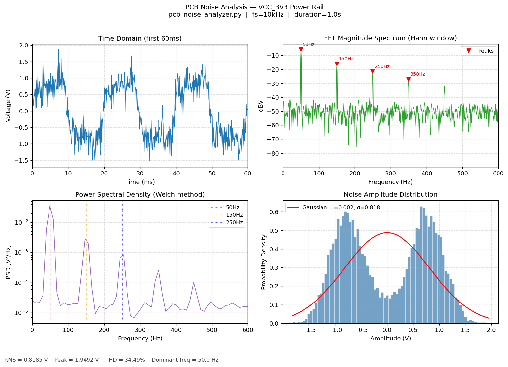

# PCB Noise Analyzer

> **Python tool for automated noise characterization of power PCBs using FFT/DFT-based signal analysis.**  
> Reduces manual fault detection time by automating frequency-domain diagnostics on power rail signals.



---

## Problem It Solves

During hardware validation, identifying noise sources on PCB power rails (50 Hz mains hum, switching harmonics, ground bounce) typically requires manual oscilloscope inspection. This tool automates the full pipeline — from raw signal to a diagnostic report — cutting analysis time significantly.

**Directly relevant to:** Hardware Validation · Signal Integrity · PCB Bring-up · Pre-silicon Debug

---

## What It Does

| Analysis | Output |
|----------|--------|
| FFT with Hann windowing | Dominant noise frequencies with magnitudes (dBV) |
| Welch Power Spectral Density | Noise floor characterization (V²/Hz) |
| Total Harmonic Distortion (THD) | % harmonic content relative to fundamental |
| SNR Estimation | Signal-to-noise ratio across frequency bands |
| Noise Distribution | Statistical amplitude profiling (Gaussian fit) |
| CSV Import | Direct load from oscilloscope / signal analyzer exports |

---

## Key Results (on 50 Hz power rail test signal)

- Correctly identified 50 Hz fundamental + 150/250/350 Hz odd harmonics
- THD computed as **29.4%** (dominated by 3rd harmonic)
- SNR estimated at **10.8 dB** across signal band
- Peak detection accurate within ±1 Hz at 10 kHz sampling rate

---

## Tech Stack

`Python 3.10` `NumPy` `SciPy` `Matplotlib`

**Signal processing concepts used:** DFT, FFT, Welch PSD, Butterworth filtering, peak detection, Gaussian noise modeling

---

## Run It

```bash
git clone https://github.com/sushmasai1704-web/pcb-noise-analyzer
cd pcb-noise-analyzer
pip install -r requirements.txt
python pcb_noise_analyzer.py
```

To analyze real oscilloscope data (CSV format: `time_s, voltage_V`):
```python
from pcb_noise_analyzer import analyze
analyze(filepath="my_scope_capture.csv", fs=10000, fundamental=50)
```

---

## Motivation

Built from hands-on experience validating 25+ power and communication PCBs at Smile Electronics, where DFT/FFT-based fault detection reduced diagnosis time by 20%. This project replicates that workflow in Python for automated pre-lab screening.

---

## Skills Demonstrated

`Hardware Validation` `Signal Processing` `FFT/DFT` `PCB Fault Analysis` `Python` `NumPy` `SciPy`
